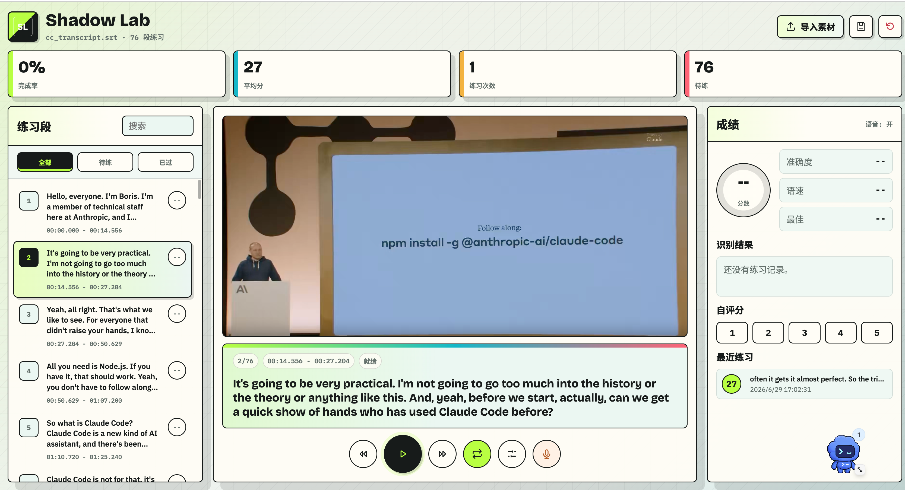

# Shadow Language Lab

[简体中文](./README.zh-CN.md)

Shadow Language Lab is a local-first shadowing practice tool for turning SRT subtitles and media files into focused speaking drills.



## What It Is

Shadow Language Lab is a static, local-first web app for shadowing practice. Import an SRT subtitle file and optional media, then practice complete multi-sentence passages instead of isolated subtitle fragments.

It is useful for practicing spoken English with talks, interviews, courses, podcasts, meeting recordings, and other timestamped material.

## Features

- Import subtitles and media from one combined picker.
- Keep imported materials in a local library so you can switch between videos.
- Automatically group fragmented SRT captions into complete practice passages.
- Loop the matching video or audio segment by subtitle timestamps.
- Automatically guide each passage through blind listening, subtitle study, and subtitle-free retelling.
- Show coarse passage progress and phrase-level highlighting while the media plays.
- Fall back to browser text-to-speech when no media file is available.
- Record your voice with the microphone.
- Replay saved practice recordings from the recent attempts list.
- Use browser speech recognition when supported.
- Score attempts by rough accuracy, pace, and overall performance.
- Add manual self-scores.
- Persist progress in local browser storage.
- Cache selected media in IndexedDB when browser storage allows.
- Adjust repeat count, playback speed, and padding around each passage.

## Quick Start

No build step or backend service is required.

```bash
python3 -m http.server 8766
```

Open:

```text
http://127.0.0.1:8766/
```

If you are outside the project directory:

```bash
cd shadow-language-lab
python3 -m http.server 8766
```

## Workflow

1. Click "Import" / "导入素材".
2. Select an `.srt` file, optionally with a video or audio file.
3. Choose a passage from the left sidebar.
4. Loop the source audio or video for that passage.
5. Record yourself shadowing the passage.
6. Review recognition, automatic scoring, or add a manual score.

## Privacy

Shadow Language Lab is local-first. Subtitles, media, and practice history stay in your browser by default and are not uploaded to a server.

Browsers cannot silently reopen the original local video path after refresh, so the app attempts to cache the selected media Blob in IndexedDB. If the media file is too large for browser storage, re-import it after refreshing the page.

## Browser Support

Latest Chrome is recommended. Speech recognition, text-to-speech, and media caching depend on browser capabilities. If one capability is unavailable, the app can still be used for subtitle passage practice and manual review.
